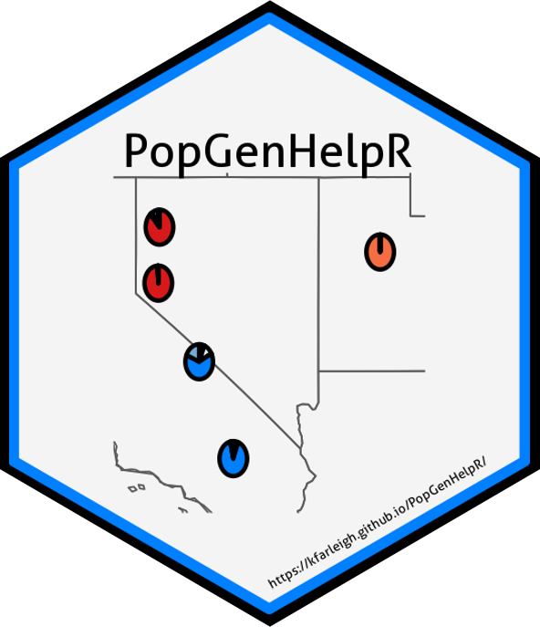

# PopGenHelpR version 1.3.1 

<!-- badges: start -->
[](https://cran.r-project.org/package=PopGenHelpR)
[](https://cran.r-project.org/package=PopGenHelpR)
[](https://opensource.org/licenses/GPL-3.0)
[](https://github.com/kfarleigh/PopGenHelpR/actions/workflows/R-CMD-check.yaml)
<!-- badges: end -->

## What is *PopGenHelpR*?
*PopGenHelpR* is an R package designed to estimate commonly used population genomic statistics and to generate publication quality figures. The current version of PopGenHelpR uses vcf, geno (012), and csv files to generate output, however, future implementations will expand the input file type options. Please see the [vignette](https://kfarleigh.github.io/PopGenHelpR/articles/PopGenHelpR_vignette.html) and other articles for examples. 

We plan to continue developing the package to include more functions, feel free to reach out to Keaka Farleigh if you have any suggestions or would like to collaborate. 

### Do you use *PopGenHelpR* in your research or class and want to be kept up to date?
Please email Keaka Farleigh (farleik@miamioh.edu) to be informed about any updates or pending changes to *PopGenHelpR*. 


## Installation

You can install *PopGenHelpR* using:

```r
install.packages("PopGenHelpR")
```

You can install the development version of *PopGenHelpR* using devtools:

``` r
devtools::install_github("kfarleigh/PopGenHelpR")
```

