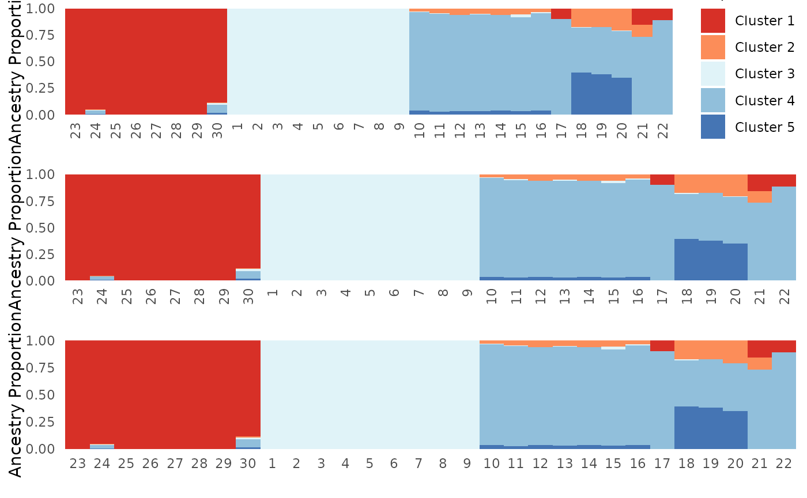

# Formatting PopGenHelpR plots

## Purpose

This document contains examples of how to format `PopGenHelpR` plots
after they are generated, but still within R.

### How to format plots after they are made?

`PopGenHelpR` plots are created using ggplot2, which means that we can
modify them after the fact. Normally, this means modifying the `theme`,
where we can change font size, axis titles, legends, and much more (see
<https://ggplot2.tidyverse.org/reference/theme.html> for ideas). We will
go through a couple of examples to get you started. Please reach out if
you have any questions or need help.

### Load the data and packages

``` r

# Load PopGenHelpR
library(PopGenHelpR)
library(cowplot)
library(ggplot2)

# Load data
data("Q_dat")

# First, we separate the list elements into two separate objects. The q-matrix (Qmat) and the locality information for each individual (Loc).
Qmat <- Q_dat[[1]]
Pops <- Q_dat[[2]]
```

We will do this using the `Ancestry_barchart` output as an example, but
this can be done with any of the plots that `PopGenHelpR` produces.

``` r


Base <- Ancestry_barchart(anc.mat = Qmat, pops = Pops, K = 5, col = c('#d73027', '#fc8d59', '#e0f3f8', '#91bfdb', '#4575b4'))
#> [1] "All information needed is present, moving onto plotting."
#> [1] "Want to change the the text size, font, or any other formatting? See https://kfarleigh.github.io/PopGenHelpR/articles/PopGenHelpR_plotformatting.html for examples and help."

No_legend <- Base$`Individual Ancestry Plot` + theme(legend.position = "none")

No_legend_lab <- Base$`Individual Ancestry Plot` + theme(legend.position = "none", axis.text.x = element_text(angle = 0, hjust = 0.5))

plot_grid(Base$`Individual Ancestry Plot`, No_legend, No_legend_lab, ncol = 1)
```



**Note:** These examples use the `Ancesry_barchart` function assuming
that `plot.type = "all"`. The commands to acess plots generated by
`PopGenHelpR` may change slightly depending on the individual command
that you execute. Setting `plot.type = "individual"`, for example, means
that you would need to replace `Individual Ancestry Plot` with
`Individual Ancestry Matrix`. Thus, the command would look like what is
below instead of what is above.

``` r


Base2 <- Ancestry_barchart(anc.mat = Qmat, pops = Pops, K = 5, col = c('#d73027', '#fc8d59', '#e0f3f8', '#91bfdb', '#4575b4'), plot.type = "individual")

No_legend <- Base$`Individual Ancestry Matrix` + theme(legend.position = "none")
```
