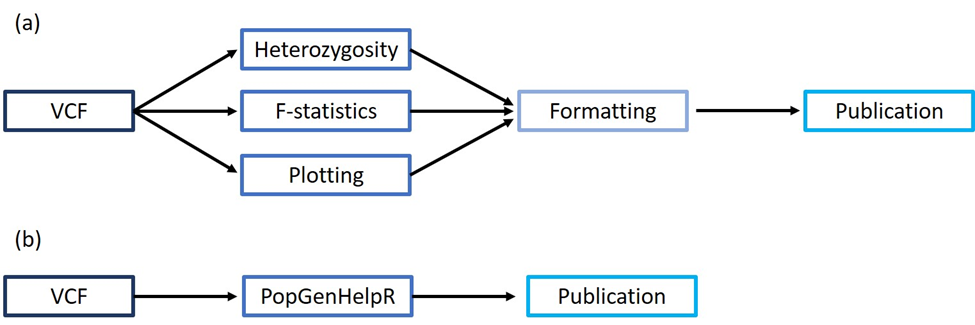

# Summary
Analysis of genomic datasets is becoming increasingly complex due to the large amounts of data produced by high-throughput sequencing methods [@Excoffier:2006; @Keenan:2013; @Lischer:2012]. Where studies once analyzed a handful of markers, it is now commonplace to include thousands of makers obtained from millions of sequencing reads [@Davey:2011]. As such, leveraging the data generated by modern techniques requires a different, and more complex skill set than what was required in earlier studies [@Andrews:2014]. Current analysis requires literacy in a combination of computer programs, and coding languages, in addition to an understanding of population genetic theory [@Andrews:2014]. Consequentially, researchers must simultaneously act as computer programmers, statistical geneticists, and biologists to correctly analyze and interpret their data [@Karl:2012; @Keenan:2013]. Therefore, software tools that facilitate informed analysis are essential [@Keenan:2013]. 

Herein, we present `PopGenHelpR` to streamline population genomic analyses (Fig. 1). `PopGenHelpR` uses variant calling format files (vcf), the default output of commonly used assembly pipelines (e.g., STACKS: [@Catchen:2013] Ipyrad: [@Eaton:2020]; dDocent: [@Puritz:2014]; Fig. 1) and currently employs wrapper functions to estimate commonly used population genomic statistics such as heterozygosity and FST. `PopGenHelpR` also contains unique plotting functions that generate commonly used visualizations (i.e., a piechart map of ancestry proportions, genetic differentiation heatmaps; Fig. 2). Another advantage of `PopGenHelpR` is that it produces output files near publication quality. Given that formatting, analysis, and visualization across many packages can be time-consuming, `PopGenHelpR` is a valuable tool for any population genomic researcher, especially those with limited coding experience.

# Statement of Need 
There are many ways to analyze genomic data because of open-source languages such as R and Python. Population genomic studies commonly estimate heterozygosity and F-statistics to understand the genetic diversity within populations and genetic differentiation among populations, respectively. Yet, few available and actively maintained packages calculate both statistics. To our knowledge, both statistics can only be estimated in three R packages (hierfstat: [@Goudet:2005]; pegas: [@Paradis:2010]; vcfR: [@Knaus:2017] and a few standalone programs (Arlequin: [@Excoffier:2010]; Genepop: [@Rousset:2008]; STACKS: [@Catchen:2013]. Moreover, these tools do not produce figures, and their default output often requires researchers to perform additional formatting before publication. Therefore, there is a need for new software tools to be developed that facilitate data analysis so that researchers can spend time interpreting data rather than formatting it. `PopGenHelpR` will streamline analysis by housing several commonly used tests in the same package, using the same input format and syntax, and by producing near publication-ready figures and output.

# Availabiity
`PopGenHelpR` is publicly available on the Comprehensive R Archive Network (CRAN) and on github (https://github.com/kfarleigh/PopGenHelpR). A vignette for `PopGenHelpR` can be found online at https://kfarleigh.github.io/PopGenHelpR/.  

# Acknowledgments
This project was supported by an National Science Foundation (NSF) Graduate Research Fellowship to KF (Award #2037786), an NSF grant to CB (DEB-1929679), and an NSF career grant to TJ (DEB-2144047). 

# References
