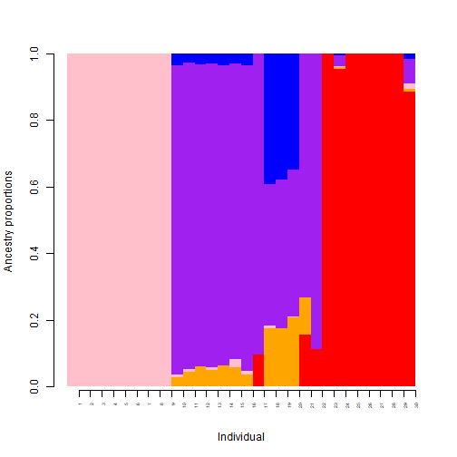
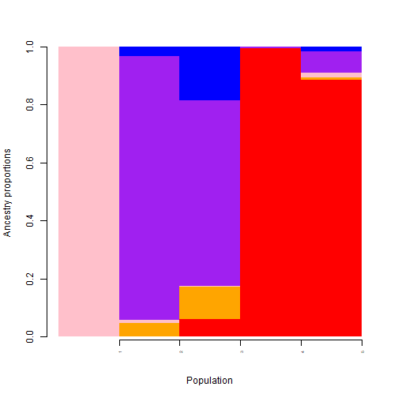
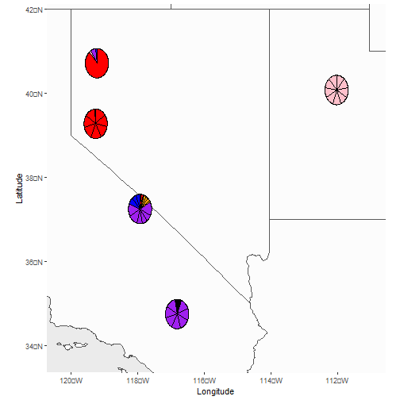
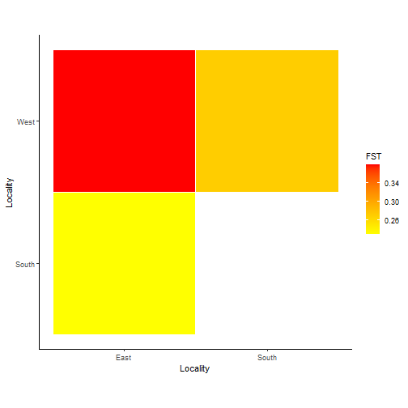
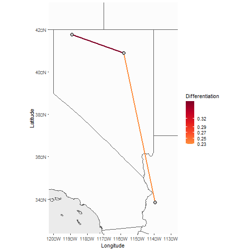
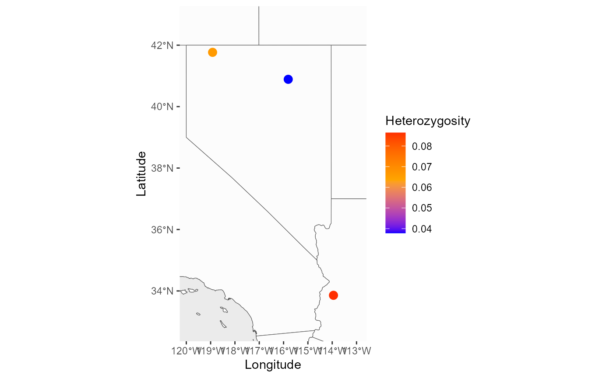

```{r, include = FALSE}
knitr::opts_chunk$set(
  collapse = TRUE,
  comment = "#>"
)
```
## Welcome
Welcome to the PopGenHelpR vignette, please contact the authors if you have any questions about the package.You can also visit our Github for additional examples (https://kfarleigh.github.io/PopGenHelpR/)
```{r setup}
# Load the package
library(PopGenHelpR)
```
First, we will load the data. These data objects are examples of input that can be used in the functions Dif_stats_Map, Div_Stats_Map, Pairwise_heatmap, and Plot_ancestry.
```{r load data}
data("Fst_dat")
data("Het_dat")
data("Q_dat")
```
### Ancestry Plots
Now we will use the data in the functions mentioned above. First, we will create structure like plots and map pie charts of individual ancestry.
```{r Plot Ancestry, eval=FALSE}
# First, we seperate the list elements into two seperate objects. The q-matrix (Qmat) and the locality information for each individual (Loc).
Qmat <- Q_dat[[1]]
Loc <- Q_dat[[2]]

# Now we will generate both population and individual plots by seeting plot.type to 'all'. If you wanted, you could only generate individual or population plots by setting plot.type to "individual" and "population", respectively.
Test_all <- Plot_ancestry(anc.mat = Qmat, pops = Loc, K = 5,
plot.type = 'all', col = c('red', 'orange', 'pink', 'purple', 'blue'), countries = c("united states of america", "mexico"), Lat_buffer = 1, Long_buffer = 1)


```


We see that the structure like plots are output automatically, but the maps are stored as elements of a list. Let's look at the maps. You'll notice that the individual map looks weird, the pie charts have a bunch of weird partitions. That's because we have multiple individuals at the same location so the population map is probably a better choice. Instead of layering individuals on top of each other, the population map averages the ancestry of individuals in a population before mapping.
```{r Plot Ancestry Maps, eval=FALSE}
Test_all$`Individual Map`

Test_all$`Population Map`

```


### Differentiation visualizations
We will use the `Fst_dat` object to visualize patterns of differentiation between populations. First, we will generate a heat map and then we will plot the realtionships on a map.
```{r Differentiation, eval=FALSE}
# Isolate our fst matrix and locality information
Fst <- Fst_dat[[1]]
Loc <- Fst_dat[[2]]
# Plot the heatmap, the statistic argument is used to label the plot.
Fstat_hmap <- Pairwise_heatmap(dat = Fst, statistic = 'FST')
# Look at the plot
Fstat_hmap

```


The heatmap is useful, but what about putting it on a map. First we will set a numeric neighbors argument to plot the Fst estimate between each population's closest neighbor. Then we will specify relationships that we want to see using the population names.
```{r Differentiation map, eval=FALSE}
# Closest Neighbor
Fst_map <- Dif_Stats_Map(dat = Fst, pops = Loc, neighbors = 1,
                     countries = c('united states of america', 'mexico'),
                     col = c('#fd8d3c','#fc4e2a','#e31a1c','#bd0026','#800026'),
                     Lat_buffer = 1, Long_buffer = 1)
Fst_map$`Differentiation Map`


Fst_map2 <- Dif_Stats_Map(dat = Fst, pops = Loc, neighbors = c('East_West', 'East_South', 'South_West'), countries = c('united states of america', 'mexico'),
                     col = c('#fd8d3c','#fc4e2a','#e31a1c','#bd0026','#800026'),
                     Lat_buffer = 1, Long_buffer = 1)
Fst_map2$`Differentiation Map`

```


### Diversity Visualizations
Finally, we will map diversity values. We can color points based on diversity estimates and interpolated values to generate a raster to see how diversity changes across space. Here we only show the point method, but feel free to reach out if you have questions about the interpolation.
```{r Diversity, eval=FALSE}
# Similar to our heat map, we use the statistic argument to label our figures and any output raster you create.
Div_map <- Div_Stats_Map(dat = Het_dat, plot.type = 'point',
statistic = "Heterozygosity", col = c('blue', 'orange', 'red'), countries = c('united states of america', 'mexico'), Lat_buffer = 1, Long_buffer = 1, prefix = 'Test_het')

Div_map$`Heterozygosity Map`

```


Thank you for your interest in our package, please reach out with any questions or things that should be included in future versions of the package.
