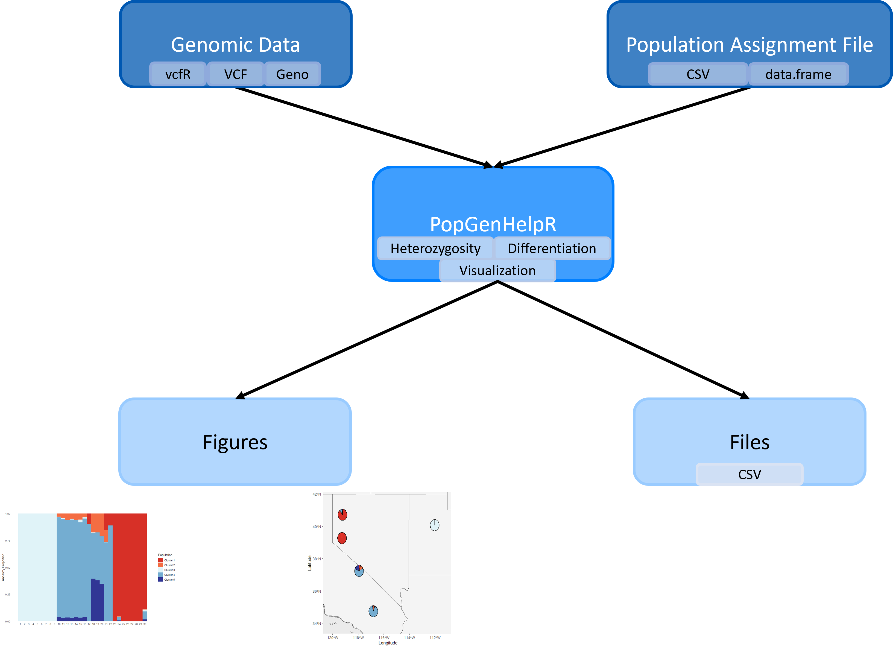
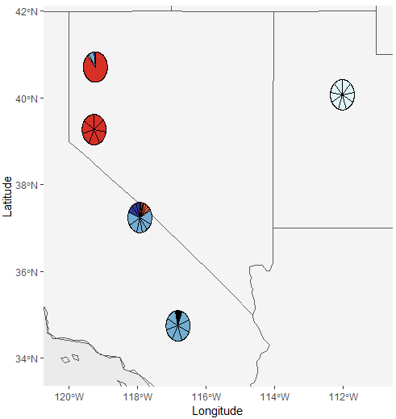
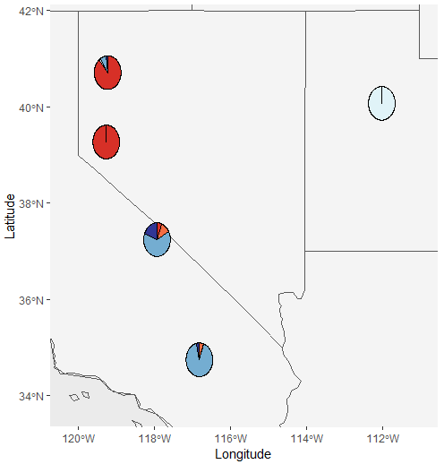
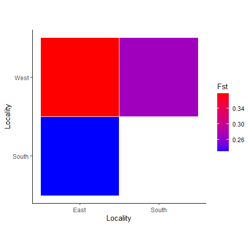

```{r, include = FALSE}
knitr::opts_chunk$set(
  collapse = TRUE,
  comment = "#>"
)
```
## Welcome

Welcome to the PopGenHelpR vignette, please contact the authors if you have any questions about the package. You can also visit our Github for additional examples (https://kfarleigh.github.io/PopGenHelpR/). 

```{r setup}
# Load the package
library(PopGenHelpR)
```

# Overview of PopGenHelpR

`PopGenHelpR` is a one-stop package for data analysis and visualization. `PopGenHelpR` can calculate commonly used population genomic statistics such as heterozygosity and genetic differentiation, with the functions `Heterozygosity`, `Differentiation`, and `Private.alleles`. While also producing publication-quality figures using the functions `Ancestry_barchart`, `Network_map`, `Pairwise_heatmap`, and `Piechart_map`. Check out the vignette below to see all of these functions in action!

```{r, out.width= "750px", out.height= "750px", echo=FALSE, eval=TRUE, fig.align='center'}

```
Fig 1. A visualization of the `PopGenHelpR` workflow. 

### Assumptions of `PopGenHelpR`

`PopGenHelpR` is designed to be easy to use, but this also means that you need to make sure that your data is in order before analysis and that you pay attention to any warnings output by the functions. 

- **Data is assumed to be bi-allelic**. Please reach out if you have any questions or need help filtering data. 

#### Load the data 

First, we will load the data. These data objects are examples of data types that can be used in the functions in `PopGenHelpR`.

```{r load data}
data("Fst_dat")
data("Het_dat")
data("Q_dat")
data("HornedLizard_Pop")
data("HornedLizard_VCF")
```

## Genomic Analysis  

Statistical analysis is a critical component population genomics study, but many R packages only calculate a subset of commonly used population genomic statistics. `PopGenHelpR` seeks to remedy this by allowing researchers to calculate widely used diversity and differentiation measures in a single package. 

### Heterozygosity

Heterozygosity is a fundamental statistic in population genomics that allows researchers to evaluate the genetic diversity of individuals and populations. `PopGenHelpR` can estimate 7 measures of heterozygosity (individual and population). Here we will calculate observed heterozygosity, but please see the documentation for `Heterozygosity` to see all of the options. Better yet, check out our [article](https://kfarleigh.github.io/PopGenHelpR/articles/PopGenHelpR_heterozygosity.html) on heterozygosity and when to use each measure!


All we need is a vcf or geno file, population assignment file, and the statistic you wish to estimate (`PopGenHelpR` does them all by default). Note that `PopGenHelpR` assumes that the first column indicates sample names and the second column indicates the population to which each individual is assigned. You can use the arguments `individual_col` and `population_col` to specify which column indicates the sample and population names, respectively. You can also write the results to a csv if you set `write = TRUE`. 

```{r Heterozygosity, echo=TRUE, eval=FALSE}
Obs_Het <- Heterozygosity(data = HornedLizard_VCF, pops = HornedLizard_Pop, statistic = "Ho")
```

### Differentiaton

Differentiation is another basic analysis in population genomic studies. `PopGenHelpR` allows you to estimate *F~st~*, *Nei's D* (individual and population), and *Jost's D*. Like `Heterozygosity`, all we need is a vcf or geno file, population assignment file, and the statistic you want to calculate (`PopGenHelpR` does them all by default). Again, individual and population columns are assumed to be the first and second columns but can be indicated by users with `individual_col` and `population_col`, respectively.  

```{r Differentiation, echo=TRUE, eval=FALSE}
Fst <- Differentiation(data = HornedLizard_VCF, pops = HornedLizard_Pop, statistic = "Fst")
```

### Private alleles

Finally, we will calculate the number of private alleles in each population. This analysis is often used to evaluate signals of range expansion and helps researchers identify populations that harbor unique alleles. Note that `Private.alleles` can only use a vcf (no geno files) and does not require you to specify a statistic (all you absolutely need is a vcf and population file). Otherwise, it operates just like `Heterozygosity` or `Differentiation`. 

```{r Private.alleles, echo=TRUE, eval=FALSE}
PA <- Private.alleles(data = HornedLizard_VCF, pops = HornedLizard_Pop)
```


Let's move onto visualizations (the fun part), so you can get your work submitted!


## Visualizations 

A strength of `PopGenHelpR` is its ability to generate publication-quality figures. You can generate commonly used figures such as ancestry plots (bar charts and piechart maps), sample maps, and other figures such as the `Network_map` that visualizes relationships between points on a map. 

### Ancestry Plots

`PopGenHelpR` can generate commonly used ancestry visualizations such as structure-like plots and ancestry piechart maps. First, we will create structure-like plots for individuals and populations. We need a q-matrix, population assignments for each individual, and the number of genetic clusters (K). The q-matrix represents the contribution of each cluster (K) to an individual or population and can be obtained from programs like STRUCTURE, ADMIXTURE, or sNMF. Please see our article on how to extract the q-matrix from these programs or email Keaka Farleigh. 

```{r Ancestry barchart, echo=TRUE, eval=FALSE}
# First, we seperate the list elements into two seperate objects. The q-matrix (Qmat) and the locality information for each individual (Loc).
Qmat <- Q_dat[[1]]
Loc <- Q_dat[[2]]

# Now we will generate both population and individual plots by setting plot.type to 'all'. If you wanted, you could only generate individual or population plots by setting plot.type to "individual" and "population", respectively.
Test_all <- Ancestry_barchart(anc.mat = Qmat, pops = Loc, K = 5,
plot.type = 'all', col = c('#d73027', '#f46d43', '#e0f3f8', '#74add1', '#313695'))

Test_all$`Individual Ancestry Plot`
```

```{r, out.width= "600px", out.height= "350px", echo=FALSE, eval=TRUE, fig.align='center'}

```

We can also generate an ancestry matrix by populations. The ancestry of each population is calculate by averaging the ancestry of the individuals in a particular population. 

```{r, eval=FALSE}
Test_all$`Population Ancestry Plot`
```

```{r, out.width= "600px", out.height= "350px", echo=FALSE, eval=TRUE, fig.align='center'}

```


Now, we will generate piechart maps of ancestry using the `Piechart_map` function. `Piechart_map` requires the same input as `Ancestry_barchart` with the additional requirement of coordinates for each individual/population. You'll notice that the individual map looks weird; the pie charts have a bunch of partitions. That's because we have multiple individuals at the same location, so the population map is probably a better choice. Instead of layering individuals on top of each other, the population map averages the ancestry of individuals in a population before mapping. See our GitHub for additional examples (https://kfarleigh.github.io/PopGenHelpR/).


```{r Piechart map, echo=TRUE, eval=FALSE, fig.align='center'}
# First, we seperate the list elements into two seperate objects. The q-matrix (Qmat) and the locality information for each individual (Loc).
Qmat <- Q_dat[[1]]
Loc <- Q_dat[[2]]

# Now we will generate both population and individual plots by setting plot.type to 'all'. If you wanted, you could only generate individual or population plots by setting plot.type to "individual" and "population", respectively.
Test_all_piemap <- Piechart_map(anc.mat = Qmat, pops = Loc, K = 5,plot.type = 'all', col = c('#d73027', '#f46d43', '#e0f3f8', '#74add1', '#313695'), 
                                Lat_buffer = 1, Long_buffer = 1)

Test_all_piemap$`Individual Map`
```

```{r, out.width= "500px", out.height= "750px", echo=FALSE, eval=TRUE, fig.align='center'}

```


Notice the weird partitions? We can take care of those using the population piechart map. 

```{r Piechart map2, echo=TRUE, eval=FALSE, fig.align='center'}
Test_all_piemap$`Population Map`
```

```{r, out.width= "500px", out.height= "750px", echo=FALSE, eval=TRUE, fig.align='center'}

```


### Differentiation visualizations

`PopGenHelpR` can use symmetric matrices such as those output by the `Differentiation` function to plot heatmaps and network maps. These plots can be great for understanding the relationships between populations or individuals. 

First, we will use the `Pairwise_heatmap` function, which allows us to see relationships between populations or individuals and only requires a symmetric matrix and legend label (statistic argument). You can also supply a color vector like we do below, but it is not required. 

```{r Pairwise Heatmap, echo=TRUE, eval=FALSE}
PW_hmap <- Pairwise_heatmap(Fst_dat[[1]], statistic = "Fst", col = c("#0000FF", "#FF0000"))
```

```{r, out.width= "600px", out.height= "600px", echo=FALSE, eval=TRUE, fig.align='center'}

```


We can also visualize these relationships on a map using the `Network_map` function. This function allows us to visualize pairwise relationships as the color of links between the points. You must supply a symmetric matrix (dat argument) and population assignment file (pops argument). The remaining arguments are optional, but they allow for greater customization. The neighbors argument, for example, tells the function how many relationships to visualize, and you can also use it to specify relationships that you want to see. Please see the documentation for details. 

```{r Network Map, echo=TRUE, eval=FALSE}
NW_map <- Network_map(Fst_dat[[1]], pops = Fst_dat[[2]], neighbors = 2, statistic = "Fst")
NW_map$Map
```
```{r, out.width= "500px", out.height= "750px", echo=FALSE, eval=TRUE, fig.align='center'}

```

`Network_map` can also be used to plot specific relationships. Let's isolate the populations with the highest and lowest Fst by supplying a character vector to the neighbors argument.

```{r Network Map2, echo=TRUE, eval=FALSE}
NW_map2 <- Network_map(Fst_dat[[1]], pops = Fst_dat[[2]], neighbors = c("East_West", "East_South"), statistic = "Fst")
NW_map2$Map
```
```{r, out.width= "500px", out.height= "750px", echo=FALSE, eval=TRUE, fig.align='center'}

```


### Heterozygosity and Other Visualizations

`PopGenHelpR` can create maps using output from `Heterozygosity` or csv files from external programs to understand how diversity (or other statistics) is distributed across geographic space. 


We will plot some observed heterozygosity data with the function `Point_map`. All you need is a data frame (or csv), and the name of whatever statistic you are plotting (statistic argument). `Point_map` also assumes that the coordinate column names are Latitude and Longitude. 

```{r Heterozygosity2, echo=TRUE, eval=FALSE}
Het_map <- Point_map(Het_dat, statistic = "Heterozygosity")
Het_map$`Heterozygosity Map`
```
```{r, out.width= "500px", out.height= "750px", echo=FALSE, eval=TRUE, fig.align='center'}

```

We can also outline the points by setting the `out.col` argument. 

```{r Heterozygosity3, echo=TRUE, eval=FALSE}
Het_map2 <- Point_map(Het_dat, statistic = "Heterozygosity", out.col = "#000000")
Het_map2$`Heterozygosity Map`
```
```{r, out.width= "500px", out.height= "750px", echo=FALSE, eval=TRUE, fig.align='center'}

```

Finally, we can just plot coordinates using `Plot_coordinates`. All we need is a data frame or csv file with the coordinates for each row indicated by columns names Latitude and Longitude. You can change the size of the points with the `size` argument. 

```{r Coordinates, echo=TRUE, eval=FALSE}
Sample_map <- Plot_coordinates(HornedLizard_Pop)
Sample_map
```
```{r, out.width= "500px", out.height= "750px", echo=FALSE, eval=TRUE, fig.align='center'}

```


Thank you for your interest in our package, please reach out to Keaka Farleigh (farleik@miamioh.edu) with any questions, things that should be included in future versions of the package, or if you would like to be kept up to date with `PopGenHelpR`.
