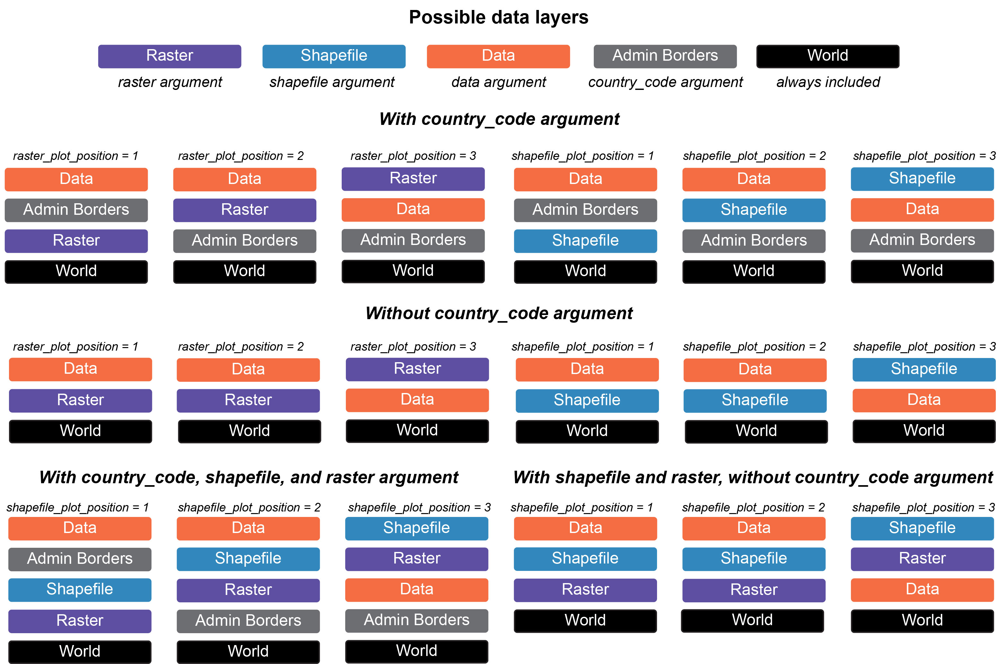

```{r, include = FALSE}
knitr::opts_chunk$set(
  collapse = TRUE,
  comment = "#>"
)
```

# Purpose
This document contains code to demonstrate how to use PopGenHelpR to create maps. The examples provdied are not comprehensive, but they should give you a solid foundation. Please reach out if you have any questions or need any help. 

## How do maps work in PopGenHelpR?

Maps in PopGenHelpR are built using `[ggplot2](https://ggplot2.tidyverse.org/)`, `[terra](https://rspatial.github.io/terra/)`, `[sf](https://cran.r-project.org/web/packages/sf/index.html)`, `[geodata](https://cran.r-project.org/web/packages/geodata/index.html)`, and `[ggspatial](https://paleolimbot.github.io/ggspatial/)`. PopGenHelpR uses these packages to build maps in layers, that are stacked on top of each other to create our final maps. Without shapefiles and rasters, PopGenHelpR will just plot your data (i.e., coordinates, piecharts) on top of a basemap, which may or may not include administrative borders (i.e., states). Then, when users add shapefiles or a raster (`shapefile` and `raster` arguments, respectively) we can manipulate the relationship of those layers using the `shapefile_plot_position` and `raster_plot_position` arguments. We have created a visualization to help users understand the `plot_position` arguments in different scenarios (see figure below).  


```{r concept_viz, out.width= "600px", out.height= "400px", echo=FALSE, eval=TRUE, fig.align='center'}

```


Conveniently, users can include any administrative borders in the `geodata` package using the `country_code` argument. This expands the utility of PopGenHelpR by providing data for the entire world, not just the United States of America. Users can also add a scale bar and north arrow (you can change the style, see below). Altogether, this allows users to create publication quality maps without the need for expensive liscences or subscriptions. 


### Notes on PopGenHelpR maps

There are a few things to be aware of with PopGenHelpR's mapping functions. 

1. You will get an inaccurate scale warning. This is expected because we are using unprojected data. If this causes serious concern please email us for help. We do not provide support for projecting data because projection can cause R to crash and can be done in `terra`. 
2. Your raster may be recognized as discrete or continous when it is not. This error comes from `terra`, we provide the `discrete_raster` argument to accommodate this. Just set it to TRUE or FALSE.
3. The `Piechart_map` function does not support rasters. This is because ggplot2 can only take one `scale_fill` per plot. With a raster, we would need two `scale_fills`. This is also why there is no outline on the `Point_map` plots that include a raster. 


Let's make a few maps!


## Load data and packages
```{r load data and source functions}

# Install developmental PopGenHelpR if needed 
devtools::install_github("kfarleigh/PopGenHelpR")

base::system("R --no-save") 

library(PopGenHelpR)
library(cowplot)
library(magrittr)

# Data

Q_dat <- PopGenHelpR::Q_dat
Pop_dat <- PopGenHelpR::HornedLizard_Pop
Fst_dat <- PopGenHelpR::Fst_dat
Het_dat <- PopGenHelpR::Het_dat

# Isolate the q-matrix and population information, create Pop_mix to show it works with a mixture of character and numerics.
Qmat <- Q_dat[[1]]
Pops <- Q_dat[[2]]

# Spatial data
shapefiles <-  system.file("extdata", package = "PopGenHelpR") |> list.files(pattern = "*.shp$", full.names = T)

# Remove the viridis shapefile
shapefiles <- shapefiles[1:8]

# Get elevation data 
raster <- geodata::elevation_global(path = tempdir(), res = 5)

# Get temperature data
temp_ras <- geodata::worldclim_global("tavg", path = tempdir(), res = 5)
```


### `Piechart_map` with shapefiles

First, let's make a piechart map with shapefiles.

```{r Piechart map,  out.width= 1000, out.height= 1250}
Shap2_piemap <- Piechart_map(anc.mat = Qmat, pops = Pops, K = 5, col = c('#d73027', '#fc8d59', '#e0f3f8', '#91bfdb', '#4575b4'), plot.type = "all", Lat_buffer = 3, Long_buffer = 3, country_code = c("usa", "can", "mex"), shapefile = shapefiles, shapefile_col = c('#9e0142','#d53e4f','#f46d43','#fdae61','#abdda4','#66c2a5','#3288bd','#5e4fa2'), shapefile_plot_position = 2,north_arrow = T, scale_bar = T, north_arrow_position = "tr") 

Shap2_piemap$Population_piemap
```

That's great, but what about if we want the shapefiles to be transparent and outlined with the colors? We will set the `shapefile_col = NA`, use the colors in `shapefile_outline_col`, and set the `shp_outwidth=1.5`. 

```{r Piechart map-1,  out.width= 1000, out.height= 1250}
Shap2_piemap_out <- Piechart_map(anc.mat = Qmat, pops = Pops, K = 5, col = c('#d73027', '#fc8d59', '#e0f3f8', '#91bfdb', '#4575b4'), plot.type = "all", Lat_buffer = 3, Long_buffer = 3, country_code = c("usa", "can", "mex"), shapefile = shapefiles, shapefile_col = NA, shapefile_outine_col =  c('#9e0142','#d53e4f','#f46d43','#fdae61','#abdda4','#66c2a5','#3288bd','#5e4fa2'), shapefile_plot_position = 2,north_arrow = T, scale_bar = T, north_arrow_position = "tr", shp_outwidt = 1.5) 

Shap2_piemap_out$Population_piemap
```


Nice, now let's compare them to see how they are different. We will use the `plot_grid` function from `cowplot`. 

```{r Piechart map-2,  out.width= 1000, out.height= 1250}


plot_grid(Shap2_piemap$Population_piemap, Shap2_piemap_out$Population_piemap, nrow = 1)

```


## `Plot_coordinates` with raster 


Well, what about rasters? Or both rasters and shapfiles? Let's make a couple of maps. We will create a map with points on top of a raster, a raster on top of everything to demonstrate the `raster_plot_position` argument, and a plot with shapfiles and rasters to show you how the `shapefile_plot_position` and `raster_plot_position` behave together. **Hint, you can plot rasters and shapefiles on top of everything else to create a map with only those layers. 

We will use elevation data from the `geodata` package as our raster. 


```{r Plot Coordinates-1, out.width= 1000, out.height= 1250}

PC_ras1 <- Plot_coordinates(Pop_dat, Longitude_col = 3, Latitude_col = 4, group = Pop_dat$Population, group_col = c('#66c2a5','#3288bd','#5e4fa2'), country_code = c("usa", "mex", "can"), raster = raster, raster_plot_position = 1, interpolate_raster = TRUE, Lat_buffer = 3, Long_buffer = 3, discrete_raster = TRUE,    
raster_col = c('white','#ffffcc','#ffeda0','#fed976','#feb24c','#fd8d3c','#fc4e2a','#e31a1c','#bd0026','#800026'), raster_breaks = c(0,500,1000,1500,2000,2500,3000,3500,4000,5000), legend_pos = "right", scale_bar = TRUE, north_arrow_position = "tr", north_arrow = TRUE)

PC_ras3 <- Plot_coordinates(Pop_dat, Longitude_col = 3, Latitude_col = 4, group = Pop_dat$Population, group_col = c('#66c2a5','#3288bd','#5e4fa2'), country_code = c("usa", "mex", "can"), raster = raster, raster_plot_position = 3, interpolate_raster = TRUE, Lat_buffer = 3, Long_buffer = 3, discrete_raster = TRUE,    
raster_col = c('white','#ffffcc','#ffeda0','#fed976','#feb24c','#fd8d3c','#fc4e2a','#e31a1c','#bd0026','#800026'), raster_breaks = c(0,500,1000,1500,2000,2500,3000,3500,4000,5000), legend_pos = "right", scale_bar = TRUE, north_arrow_position = "tr", north_arrow = TRUE)


plot_grid(PC_ras1, PC_ras3
          )
```

Now, we will make a map with shapefiles and a raster. Notice that the shapefile is on top of the raster and that the `raster_plot_position` argument does not matter. This is because `PopGenHelpR` uses the `shapefile_plot_position` arugment to determine the placement of these layers when both a shapefile and raster are provided. 

```{r Plot Coordinates-3, out.width= 1000, out.height= 1250}

PC_ras_shp <- Plot_coordinates(Pop_dat, Longitude_col = 3, Latitude_col = 4, group = Pop_dat$Population, group_col = c('#66c2a5','#3288bd','#5e4fa2'), country_code = c("usa", "mex", "can"), shapefile = shapefiles, shapefile_plot_position = 1, raster = raster, raster_plot_position = 2, interpolate_raster = TRUE, Lat_buffer = 3, Long_buffer = 3, discrete_raster = TRUE, shapefile_outline_col = c('#9e0142','#d53e4f','#f46d43','#fdae61','#abdda4','#66c2a5','#3288bd','#5e4fa2'),    raster_col = c('white','#ffffcc','#ffeda0','#fed976','#feb24c','#fd8d3c','#fc4e2a','#e31a1c','#bd0026','#800026'), raster_breaks = c(0,500,1000,1500,2000,2500,3000,3500,4000,5000), legend_pos = "right", scale_bar = TRUE, north_arrow_position = "tr", north_arrow = TRUE)

PC_ras_shp

```


### Changing the north arrow.

Finally, we will change the north arrow style using the `north_arrow_style` argument. By default, it is `north_arrow_style = ggspatial::north_arrow_nautical()`. Let's change it to `north_arrow_style =north_arrow_orienteering()` and compare the two. 

```{r Arrow, out.width= 1000, out.height= 1250}
Shap2_piemap_arrow <- Piechart_map(anc.mat = Qmat, pops = Pops, K = 5, col = c('#d73027', '#fc8d59', '#e0f3f8', '#91bfdb', '#4575b4'), plot.type = "all", Lat_buffer = 3, Long_buffer = 3, country_code = c("usa", "can", "mex"), shapefile = shapefiles, shapefile_col = c('#9e0142','#d53e4f','#f46d43','#fdae61','#abdda4','#66c2a5','#3288bd','#5e4fa2'), shapefile_plot_position = 2,north_arrow = T, scale_bar = T, north_arrow_position = "tr",  north_arrow_style = ggspatial::north_arrow_nautical()) 

Shap2_piemap_arrow2 <- Piechart_map(anc.mat = Qmat, pops = Pops, K = 5, col = c('#d73027', '#fc8d59', '#e0f3f8', '#91bfdb', '#4575b4'), plot.type = "all", Lat_buffer = 3, Long_buffer = 3, country_code = c("usa", "can", "mex"), shapefile = shapefiles, shapefile_col = c('#9e0142','#d53e4f','#f46d43','#fdae61','#abdda4','#66c2a5','#3288bd','#5e4fa2'), shapefile_plot_position = 2,north_arrow = T, scale_bar = T, north_arrow_position = "tr",  north_arrow_style = ggspatial::north_arrow_orienteering()) 


plot_grid(Shap2_piemap_arrow$Population_piemap, Shap2_piemap_outarrow2$Population_piemap, nrow = 1)
```
