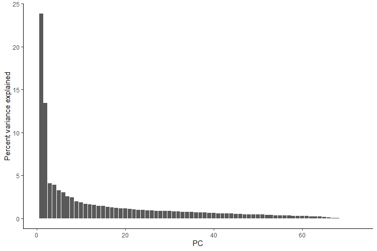
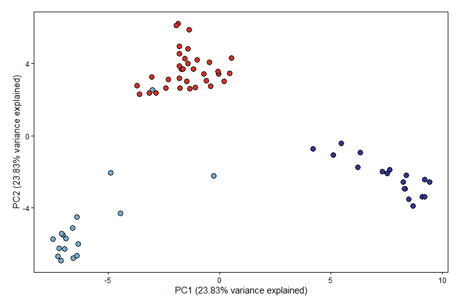

```{r, include = FALSE}
knitr::opts_chunk$set(
  collapse = TRUE,
  comment = "#>"
)
```
## Purpose

To perform principal component analysis using the `PCA` function in `PopGenHelpR`.

## Overview

Principal component analysis (PCA) is a widely used technique to identify patterns of genetic structure in genomic data or any data really. PCA is commonly paired with structure-like analyses since PCA is model-free, meaning that it is not based on any biological model (see Patterson et al., 2006 for a discussion on model vs model-free approaches). 

We will perform PCA and visualize the results. ***Note that we use `ggplot2` to visualize the results, not `PopGenHelpR`.***

### Load the data

```{r setup, eval=TRUE, echo=TRUE}
# Load PopGenHelpR
library(PopGenHelpR)
library(ggplot2)

# Load data
data("HornedLizard_VCF")
data("HornedLizard_Pop")
```


## Performing a PCA in `PopGenHelpR`

Running a PCA in `PopGenHelpR` is straightforward and only requires the genetic data. One caveat is that the data must be complete, meaning that there is no missing data. This means that you will have to impute most genomic data sets, or perform stringent filtering; I usually use `LEA` to impute my data (Frichot et al., 2015).

```{r PCA, eval=FALSE, echo=TRUE}
HL_pca <- PCA(HornedLizard_VCF)

```

Our `HL_pca` object is a list with two elements. First, we have the loadings of each individual (sample) on the principal components. Second, we have the percent variance explained by each principal component (PC). We expect that the first few PCs will explain the majority of the variance, and most researchers generate PCA scatter plots using the first few PCs.

## Visualizng the PCA results

Let's see how much variance is explained by the first 10 PCs.

```{r PC var, eval=FALSE, echo=TRUE}
Var_exp <- as.data.frame(t(HL_pca$`Variance Explained`))
Var_exp$PC <- seq(1:nrow(Var_exp))

## Plot the percent variance explained

ggplot(Var_exp, aes(x = PC, y = `Percent variance explained`)) + geom_bar(stat = "identity") + theme_classic() 
```

```{r, out.width= "600px", out.height= "350px", echo=FALSE, eval=TRUE, fig.align='center'}

```

We see that the first two principal components account for the majority of the variance, so we will generate a pca scatter plot using those axes. We will color the points according to which population/genetic cluster they belong to. This is commonly done to see if both model-free (e.g., PCA) and model-based (e.g., sNMF) analyses agree. 

This will also require additional information (a population assignment file) to color the points.

```{r PCA scatter, echo=TRUE, eval=FALSE}
# Get the population information
Pop <- HornedLizard_Pop

# Check to see if the PCA individuals and Pop indivudals are  ordered in the same way, we expect it to be TRUE
rownames(Dat_loadings) == Pop$Sample

# Isolate loadings for the first 2 PCs
Scores_toplot <- as.data.frame(Dat_loadings[,1:2])
Scores_toplot$group <- Pop$Population

# Set colors for each group
Scores_toplot$group[Scores_toplot$group == 'South'] <- "#d73027" 
Scores_toplot$group[Scores_toplot$group == 'East'] <- "#74add1"
Scores_toplot$group[Scores_toplot$group == 'West'] <- "#313695"

# Create a custom theme
theme<-theme(panel.background = element_blank(),panel.border=element_rect(fill=NA),
             panel.grid.major = element_blank(),panel.grid.minor = element_blank(),
             strip.background=element_blank(),axis.text.x=element_text(colour="black"),
             axis.text.y=element_text(colour="black"),axis.ticks=element_line(colour="black"),
             plot.margin=unit(c(1,1,1,1),"line"))

# Plot and include the variance explained by the axes wer are plotting
ggplot(Scores_toplot, aes(x = PC1, y = PC2)) + 
  geom_point(shape = 21, color = "black", fill = Scores_toplot$group, size = 3) +
  scale_shape_identity() + theme + ylab(paste("PC2 (", round(Dat_pc_var[2,1],2),"% variance explained)", sep = "")) + xlab(paste("PC1 (", round(Dat_pc_var[1,1],2),"% variance explained)", sep = ""))

```

```{r, out.width= "600px", out.height= "350px", echo=FALSE, eval=TRUE, fig.align='center'}

```

We see that there are 3 main clusters in our PCA and that the individuals largely cluster by the population/genetic cluster that was assigned by sNMF, with the exception of sample E_71_7760.


## Questions???

Please email Keaka Farleigh (farleik@miamioh.edu) if you need help generating a q-matrix or with anything else. 

## References

  - Frichot, E., & François, O. (2015). LEA: An R package for landscape and ecological association studies. Methods in Ecology and Evolution, 6(8), 925-929. https://doi.org/10.1111/2041-210X.12382
  - Patterson, N., Price, A. L., & Reich, D. (2006). Population structure and eigenanalysis. PLoS genetics, 2(12), e190. https://doi.org/10.1371/journal.pgen.0020190


