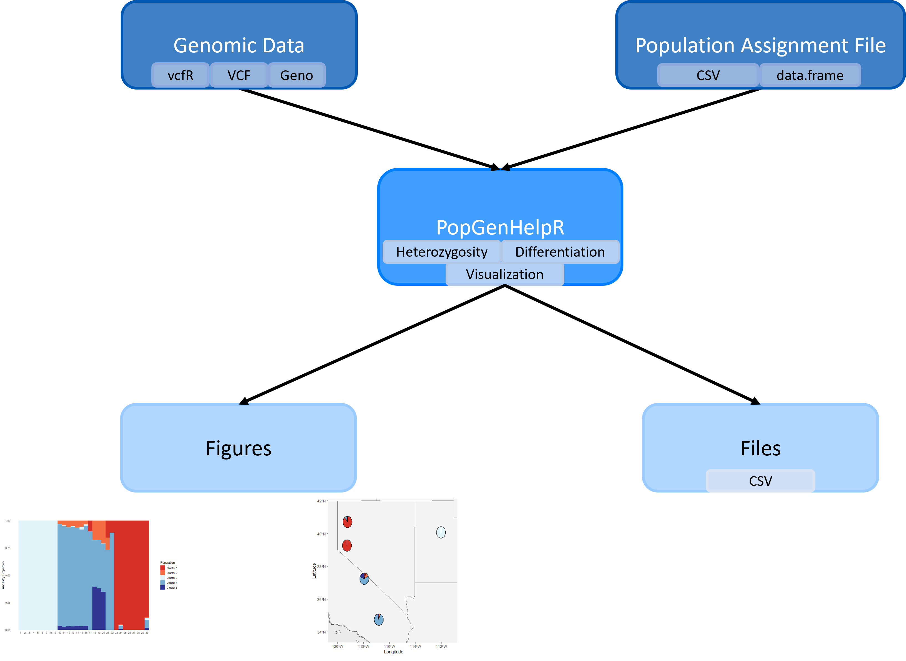

```{r, include = FALSE}
knitr::opts_chunk$set(
  collapse = TRUE,
  comment = "#>"
)
```
## Welcome
Welcome to the PopGenHelpR vignette, please contact the authors if you have any questions about the package. You can also visit our Github for additional examples (https://kfarleigh.github.io/PopGenHelpR/). 

```{r setup}
# Load the package
library(PopGenHelpR)
```

# Overview of PopGenHelpR
`PopGenHelpR` is a one-stop package for data analysis and visualization. `PopGenHelpR` can calculate commonly used population genomic statistics such as heterozygosity and genetic differentiation, with the functions `Heterozygosity`, `Differentiation`, and `Private.alleles`. While also producing publication-quality figures using the functions `Ancestry_barchart`, `Network_map`, `Pairwise_heatmap`, and `Piechart_map`. Check out the vignette below to see all of these functions in action!

```{r, out.width= "750px", out.height= "750px", echo=FALSE, eval=TRUE, fig.align='center'}

```
Fig 1. A visualization of the `PopGenHelpR` workflow. 

