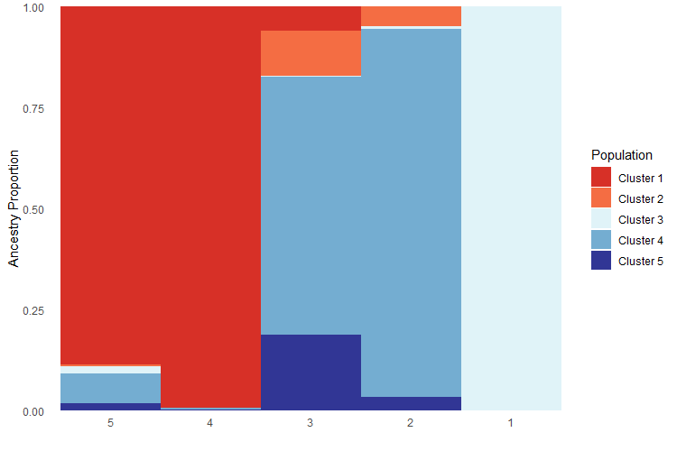
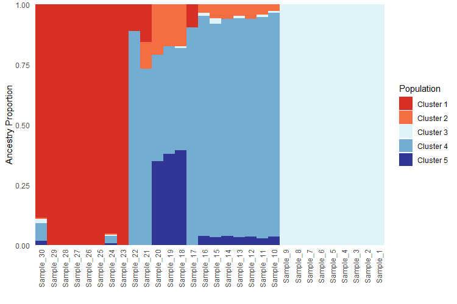
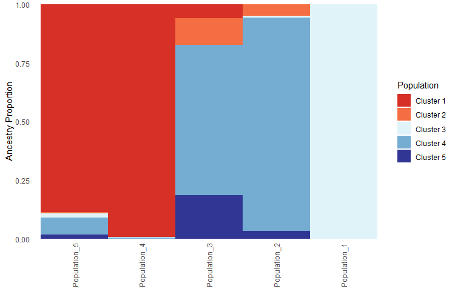

```{r, include = FALSE}
knitr::opts_chunk$set(
  collapse = TRUE,
  comment = "#>"
)
```
## Purpose

To sort a q-matrix of ancestry coefficients for use in the `PopGenHelpR` function `Ancestry_barchart`.

## Overview

We often want to plot our structure-like ancestry bar chart in a specific order. We may wish to visualize the ancestry chart by grouping individuals of the same cluster together (e.g., ordered by cluster) or by latitude or longitude (to match the pie chart map). To do this, we can use the `ind.ord` and `pop.ord` arguments in the `Ancestry_barchart` function.

### Load the data
```{r setup, eval=FALSE, echo=TRUE}
# Load PopGenHelpR
library(PopGenHelpR)

# Load data
data("Q_dat")

# First, we separate the list elements into two separate objects. The q-matrix (Qmat) and the locality information for each individual (Loc).
Qmat <- Q_dat[[1]]
Loc <- Q_dat[[2]]
```

## Sorting a Q-matrix

First, we will create a vector that contains the order of individuals and populations that we want our barcharts to be in. Then we use the `ind.order` and `pop.order` arguments to specify them. ***Note that the individuals and populations in `ind.order` and `pop.order` must match the individual and population names in your population assignment file (the `pops` argument). 

```{r Sorting, eval=FALSE,echo=TRUE}
# Set orders
Ind_ord <- rev(seq(1,30))
Pop_ord <- rev(seq(1,5))

Anc_ord <- Ancestry_barchart(Qmat, Loc, K = 5, col = c('#d73027', '#f46d43', '#e0f3f8', '#74add1', '#313695'), ind.order = Ind_ord, pop.order = Pop_ord)

Anc_ord$`Individual Ancestry Plot`
```

```{r, out.width= "600px", out.height= "350px", echo=FALSE, eval=TRUE, fig.align='center'}
knitr::include_graphics("Anc_barchart_sortedinds.png")
```

```{r, eval=FALSE, echo=TRUE}
Anc_ord$`Population Ancestry Plot`
```


```{r, out.width= "600px", out.height= "350px", echo=FALSE, eval=TRUE, fig.align='center'}

```

We can do the same thing if our sample and population names are character strings; just remember that `PopGenHelpR` requires that your individual and population names are the same type; they must be characters or numeric.

```{r Character plotting, eval = FALSE, echo=TRUE}
# Make the sample and population names characters
Qmat_char <- Qmat
Qmat_char$Ind <- paste("Sample", Qmat_char$Ind, sep = '_')

Loc_char <- Loc
Loc_char$Sample <- paste("Sample", Loc_char$Sample, sep = '_')
Loc_char$Population <- paste("Population", Loc_char$Population, sep = '_')

Ind_ord_char <- paste('Sample', Ind_ord, sep = '_')
Pop_ord_char <- paste('Population', Pop_ord, sep = '_')

Anc_ord_char <- Ancestry_barchart(Qmat_char, Loc_char, K = 5, col = c('#d73027', '#f46d43', '#e0f3f8', '#74add1', '#313695'), ind.order = Ind_ord_char, pop.order = Pop_ord_char)

Anc_ord_char$`Individual Ancestry Plot`
```

```{r, out.width= "600px", out.height= "350px", echo=FALSE, eval=TRUE, fig.align='center'}

```

```{r, eval=FALSE, echo=TRUE}
Anc_ord_char$`Population Ancestry Plot`
```

```{r, out.width= "600px", out.height= "350px", echo=FALSE, eval=TRUE, fig.align='center'}

```

## Questions???

Please email Keaka Farleigh (farleik@miamioh.edu) if you need help generating a q-matrix or with anything else. 


